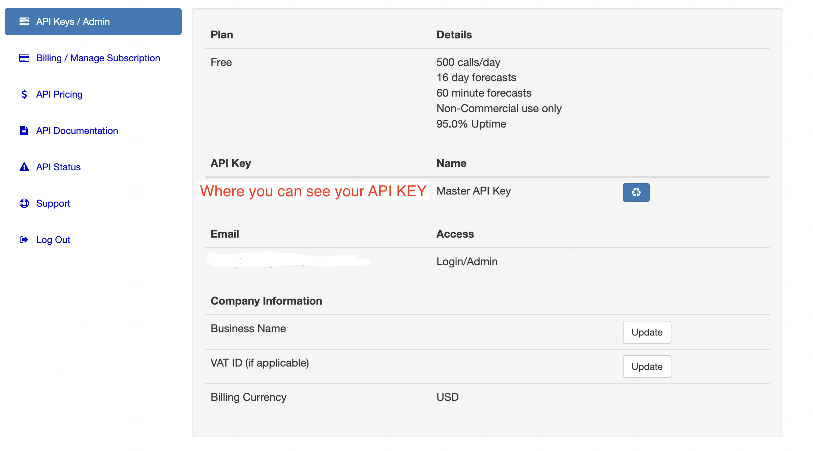

<h1>Current Weather API</h1>  
Reference: <a href="https://www.weatherbit.io/api/airquality-current" target="_blank">current weather api</a>

1. Basic info:
The API I wrote is to view the Weather API. This is an API provided by weatherbit. IO that provides a key and corresponding information to get real-time weather information about a place or weather related information like air quality.


2. Base URL:
>>
HTTP: http://api.weatherbit.io/v2.0/current  
HTTPS: https://api.weatherbit.io/v2.0/current  
Supported Methods: GET


3. Request Parameters:  
    >3.1 key=[key] (REQUIRED)  
    >>
        key - Your API Key.

    >3.2 lang=[language](optional)  
    >>
        en - [DEFAULT] English  
        ar - Arabic  
        az - Azerbaijani  
        be - Belarusian  
        bg - Bulgarian  
        bs - Bosnian  
        ca - Catalan  
        cz - Czech  
        da - Danish  
        de - German  
        fi - Finnish  
        fr - French  
        el - Greek  
        es - Spanish  
        et - Estonian  
        ja - Japanese  
        hr - Croation  
        hu - Hungarian  
        id - Indonesian  
        it - Italian  
        is - Icelandic  
        iw - Hebrew  
        kw - Cornish  
        lt - Lithuanian  
        nb - Norwegian Bokmål  
        nl - Dutch  
        pl - Polish  
        pt - Portuguese  
        ro - Romanian  
        ru - Russian  
        sk - Slovak  
        sl - Slovenian  
        sr - Serbian  
        sv - Swedish  
        tr - Turkish  
        uk - Ukrainian  
        zh - Chinese (Simplified)  
        zh-tw - Chinese (Traditional) 
  
    >3.3 units=[units](optional)
    >>
        M - [DEFAULT] Metric (Celcius, m/s, mm)
        S - Scientific (Kelvin, m/s, mm)
        I - Fahrenheit (F, mph, in)

4. How to get your API key:
    >4.1 Register/Login at <a href="https://www.weatherbit.io/" target="_blank">weather.io</a>  

    >4.2 First time user: you will need to set up your account info:
      
    For tiers, we can choose this free plan:
      
    Then, our API key is in our account page(only can access after login)
      
    
5. API Endpoints
    | Description                              | Required Parameters | Example |
    | :--------------------------------------- | :------------------ | :----------------|
    | Get observation by lat/lon (Recommended) | lat,lon             | &lat=38.123&lon=-78.543 |
    | Get observation by city name             | city, state(optional), country (optional) | &city=Raleigh&country=US |
    | Get observation by postal code | postal_code, country (optional)	| &postal_code=27601&country=US |
    | Get observation by city id's	| city_id	| &city_id=8953360 |
    | Get observation by ICAO or station id | station | &station=KRDU |
    | Get multiple observations from a list of city id's | cities | &cities=8953360,8953361,8953362 |
    | Get multiple observations by airport ICAO's, or station id's| stations | &stations=KRDU,KSEA,LEBB |
    | Get multiple observations by lat/lon(s) | points | &points=(35.88,-78.79),(47.45,-122.3),(43.3,-2.93) |


6. Example Request:
    > URL: 
    >> https://api.weatherbit.io/v2.0/current?lat=35.7796&lon=-78.6382&key=API_KEY&include=minutely  

    > Code: (remember to replace key with your api key)
    ``` PHP
    Route::get('/weather', function() {
        return Http::get("https://api.weatherbit.io/v2.0/current?lat=35.7796&lon=-78.6382&key=YOUR_API_KEY&include=minutely")->json();
    });
    ```

    > Result (JSON): on <a href="https://assignment7-jiahang.herokuapp.com/weather" target="_blank"> /path/to/weather </a>
    ```
    {
        data: [
            {
                rh: 30,
                pod: "d",
                lon: -78.64,
                pres: 1002.3,
                timezone: "America/New_York",
                ob_time: "2022-04-10 22:50",
                country_code: "US",
                clouds: 25,
                ts: 1649631000,
                solar_rad: 96.6,
                state_code: "NC",
                city_name: "Raleigh",
                wind_spd: 2.68,
                wind_cdir_full: "west",
                wind_cdir: "W",
                slp: 1014.6,
                vis: 10,
                h_angle: 77.1,
                sunset: "23:44",
                dni: 418.51,
                dewpt: -0.6,
                snow: 0,
                uv: 1.48069,
                precip: 0,
                wind_dir: 265,
                sunrise: "10:46",
                ghi: 97.34,
                dhi: 46.67,
                aqi: 43,
                lat: 35.78,
                weather: {
                    icon: "c02d",
                    code: 801,
                    description: "Few clouds"
                },
                datetime: "2022-04-10:23",
                temp: 17.1,
                station: "1327W",
                elev_angle: 8.16,
                app_temp: 17.2
            }
        ],
        count: 1
    }
    ```


7. Result Description(json) :
```
    count: Count of returned observations.
    data: [
        lat: Latitude (Degrees).
        lon: Longitude (Degrees).
        sunrise: Sunrise time (HH:MM).
        sunset: Sunset time (HH:MM).
        timezone: Local IANA Timezone.
        station: Source station ID.
        ob_time: Last observation time (YYYY-MM-DD HH:MM).
        datetime: Current cycle hour (YYYY-MM-DD:HH).
        ts: Last observation time (Unix timestamp).
        city_name: City name.
        country_code: Country abbreviation.
        state_code: State abbreviation/code.
        pres: Pressure (mb).
        slp: Sea level pressure (mb).
        wind_spd: Wind speed (Default m/s).
        wind_dir: Wind direction (degrees).
        wind_cdir: Abbreviated wind direction.
        wind_cdir_full: Verbal wind direction.
        temp: Temperature (default Celcius).
        app_temp: Apparent/"Feels Like" temperature (default Celcius).
        rh: Relative humidity (%).
        dewpt: Dew point (default Celcius).
        clouds: Cloud coverage (%).
        pod: Part of the day (d = day / n = night).
        weather: {
        icon:Weather icon code.
        code:Weather code.
        description: Text weather description.
        }
        vis: Visibility (default KM).
        precip: Liquid equivalent precipitation rate (default mm/hr).
        snow: Snowfall (default mm/hr).
        uv: UV Index (0-11+).
        aqi: Air Quality Index [US - EPA standard 0 - +500]
        dhi: Diffuse horizontal solar irradiance (W/m^2) [Clear Sky]
        dni: Direct normal solar irradiance (W/m^2) [Clear Sky]
        ghi: Global horizontal solar irradiance (W/m^2) [Clear Sky]
        solar_rad: Estimated Solar Radiation (W/m^2).
        elev_angle: Solar elevation angle (degrees).
        h_angle: Solar hour angle (degrees).
    ]
```