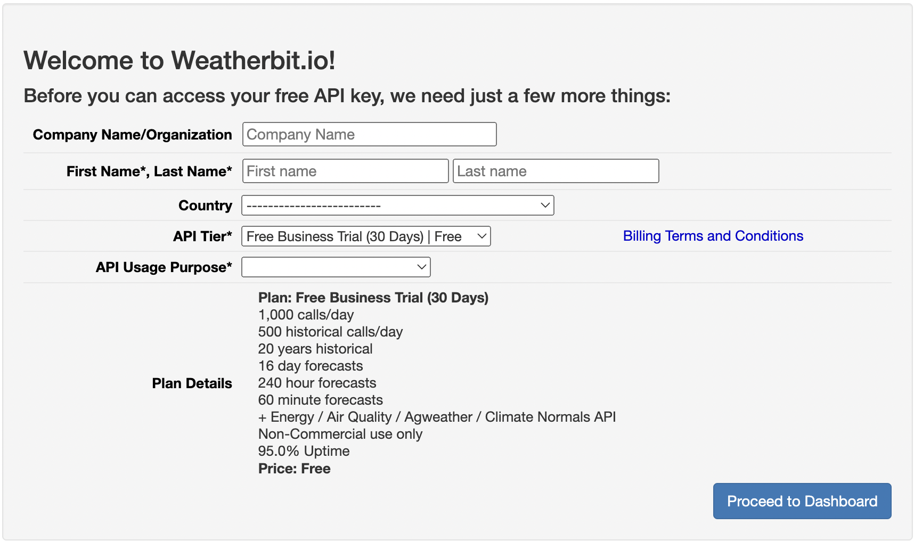

<h1>Current Weather API</h1>  
Reference: <a href="https://www.weatherbit.io/api/airquality-current" target="_blank">current weather api</a>

1. Basic info:
The API I wrote is to view the Weather API. This is an API provided by weatherbit. IO that provides a key and corresponding information to get real-time weather information about a place or weather related information like air quality.


2. Base URL:
>>
HTTP: http://api.weatherbit.io/v2.0/current  
HTTPS: https://api.weatherbit.io/v2.0/current  
Supported Methods: GET


3. Request Parameters:  
    >3.1 key=[key] (REQUIRED)  
    >>
        key - Your API Key.

    >3.2 lang=[language](optional)  
    >>
        en - [DEFAULT] English  
        ar - Arabic  
        az - Azerbaijani  
        be - Belarusian  
        bg - Bulgarian  
        bs - Bosnian  
        ca - Catalan  
        cz - Czech  
        da - Danish  
        de - German  
        fi - Finnish  
        fr - French  
        el - Greek  
        es - Spanish  
        et - Estonian  
        ja - Japanese  
        hr - Croation  
        hu - Hungarian  
        id - Indonesian  
        it - Italian  
        is - Icelandic  
        iw - Hebrew  
        kw - Cornish  
        lt - Lithuanian  
        nb - Norwegian Bokmål  
        nl - Dutch  
        pl - Polish  
        pt - Portuguese  
        ro - Romanian  
        ru - Russian  
        sk - Slovak  
        sl - Slovenian  
        sr - Serbian  
        sv - Swedish  
        tr - Turkish  
        uk - Ukrainian  
        zh - Chinese (Simplified)  
        zh-tw - Chinese (Traditional) 
  
    >3.3 units=[units](optional)
    >>
        M - [DEFAULT] Metric (Celcius, m/s, mm)
        S - Scientific (Kelvin, m/s, mm)
        I - Fahrenheit (F, mph, in)

4. How to get your API key:
    >4.1 Register/Login at <a href="https://www.weatherbit.io/" target="_blank">weather.io</a>  

    >4.2 First time user: you will need to set up your account info:
      
    For tiers, we can choose this free plan:
      
    Then, our API key is in our account page(only can access after login)
      
    
5. API Endpoints
    | Description                              | Required Parameters | Example |
    | :--------------------------------------- | :------------------ | :----------------|
    | Get observation by lat/lon (Recommended) | lat,lon             | &lat=38.123&lon=-78.543 |
    | Get observation by city name             | city, state(optional), country (optional) | &city=Raleigh&country=US |
    | Get observation by postal code | postal_code, country (optional)	| &postal_code=27601&country=US |
    | Get observation by city id's	| city_id	| &city_id=8953360 |
    | Get observation by ICAO or station id | station | &station=KRDU |
    | Get multiple observations from a list of city id's | cities | &cities=8953360,8953361,8953362 |
    | Get multiple observations by airport ICAO's, or station id's| stations | &stations=KRDU,KSEA,LEBB |
    | Get multiple observations by lat/lon(s) | points | &points=(35.88,-78.79),(47.45,-122.3),(43.3,-2.93) |


6. Example Request:
    > URL: 
    >> https://api.weatherbit.io/v2.0/current?lat=35.7796&lon=-78.6382&key=API_KEY&include=minutely  

    > Code: (remember to replace key with your api key)
    ``` PHP
    Route::get('/weather', function() {
        return Http::get("https://api.weatherbit.io/v2.0/current?lat=35.7796&lon=-78.6382&key=YOUR_API_KEY&include=minutely")->json();
    });
    ```

    > Result (JSON): on <a href="https://assignment7-jiahang.herokuapp.com/weather" target="_blank"> /path/to/weather </a>
    ```
    {
        data: [
            {
                rh: 30,
                pod: "d",
                lon: -78.64,
                pres: 1002.3,
                timezone: "America/New_York",
                ob_time: "2022-04-10 22:50",
                country_code: "US",
                clouds: 25,
                ts: 1649631000,
                solar_rad: 96.6,
                state_code: "NC",
                city_name: "Raleigh",
                wind_spd: 2.68,
                wind_cdir_full: "west",
                wind_cdir: "W",
                slp: 1014.6,
                vis: 10,
                h_angle: 77.1,
                sunset: "23:44",
                dni: 418.51,
                dewpt: -0.6,
                snow: 0,
                uv: 1.48069,
                precip: 0,
                wind_dir: 265,
                sunrise: "10:46",
                ghi: 97.34,
                dhi: 46.67,
                aqi: 43,
                lat: 35.78,
                weather: {
                    icon: "c02d",
                    code: 801,
                    description: "Few clouds"
                },
                datetime: "2022-04-10:23",
                temp: 17.1,
                station: "1327W",
                elev_angle: 8.16,
                app_temp: 17.2
            }
        ],
        count: 1
    }
    ```


7. Result Description(json) :
```
    count: Count of returned observations.
    data: [
        lat: Latitude (Degrees).
        lon: Longitude (Degrees).
        sunrise: Sunrise time (HH:MM).
        sunset: Sunset time (HH:MM).
        timezone: Local IANA Timezone.
        station: Source station ID.
        ob_time: Last observation time (YYYY-MM-DD HH:MM).
        datetime: Current cycle hour (YYYY-MM-DD:HH).
        ts: Last observation time (Unix timestamp).
        city_name: City name.
        country_code: Country abbreviation.
        state_code: State abbreviation/code.
        pres: Pressure (mb).
        slp: Sea level pressure (mb).
        wind_spd: Wind speed (Default m/s).
        wind_dir: Wind direction (degrees).
        wind_cdir: Abbreviated wind direction.
        wind_cdir_full: Verbal wind direction.
        temp: Temperature (default Celcius).
        app_temp: Apparent/"Feels Like" temperature (default Celcius).
        rh: Relative humidity (%).
        dewpt: Dew point (default Celcius).
        clouds: Cloud coverage (%).
        pod: Part of the day (d = day / n = night).
        weather: {
        icon:Weather icon code.
        code:Weather code.
        description: Text weather description.
        }
        vis: Visibility (default KM).
        precip: Liquid equivalent precipitation rate (default mm/hr).
        snow: Snowfall (default mm/hr).
        uv: UV Index (0-11+).
        aqi: Air Quality Index [US - EPA standard 0 - +500]
        dhi: Diffuse horizontal solar irradiance (W/m^2) [Clear Sky]
        dni: Direct normal solar irradiance (W/m^2) [Clear Sky]
        ghi: Global horizontal solar irradiance (W/m^2) [Clear Sky]
        solar_rad: Estimated Solar Radiation (W/m^2).
        elev_angle: Solar elevation angle (degrees).
        h_angle: Solar hour angle (degrees).
    ]
```
****
<h1>Google Login API</h1> 

1. Basic info:
Using this API, you can integrate Google Sign-in into your web applications via OAuth 2.0.  

2. Preparation:
>Login to your google account. Then go to <a href="https://console.developers.google.com/apis/credentials">Credential Page</a>  
>If it is your first time using this, you need first create your project, then go to OAuth consent screen to create a consent (Both internal and external will work, if there's no publishing plan, internal will be easier).  
>Then, go to Credentials, and click on Create Credentials to create a OAuth 2.0 Credentials (In this class, we might need a web application). We need to fill in Authorized JavaScript origins(the HTTP origins that host your web application) and Authorized redirect URIs (Users will be redirected to this path after they have authenticated with Google, like index).  
> Then, the OAuth 2.0 Client IDs will be in the Credentials page under client ID (which is end with .apps.googleusercontent.com)  

3. Usage:
> Load the Google Platform Library:
> You must include the Google Platform Library on your web pages that integrate Google Sign-In. (like in the index page)
```
<script src="https://apis.google.com/js/platform.js" async defer></script>
```  

> Specify your app's client ID:
> Specify the client ID you created for your app in the Google Developers Console with the google-signin-client_id meta element.  
```
<meta name="google-signin-client_id" content="YOUR_CLIENT_ID.apps.googleusercontent.com">
```

> Then, we can use a Google Sign-In button to implement the sign-in function. With only a few lines of code, you can add a button that automatically configures itself to have the appropriate text, logo, and colors for the sign-in state of the user and the scopes you request.  
``` html
<div class="g-signin2" data-onsuccess="onSignIn"></div>
```  
> Then, within the script part, we can access the logged-in user's info by using google function like onSignIn(googleUser) function to handle the googleUser(object of user).

> Or, we can customize the login button by using auth2 = gapi.auth2.init() function to login. Here's an example:

``` javascript
<script>
  var googleUser = {};
  var startApp = function() {
    gapi.load('auth2', function(){
      // Retrieve the singleton for the GoogleAuth library and set up the client.
      auth2 = gapi.auth2.init({
        client_id: 'YOUR_CLIENT_ID',
        cookiepolicy: 'single_host_origin',
        // Request scopes in addition to 'profile' and 'email'
        //scope: 'additional_scope'
      });
      attachSignin(document.getElementById('customBtn'));
    });
  };

  function attachSignin(element) {
    console.log(element.id);
    auth2.attachClickHandler(element, {},
        function(googleUser) {
          // display as JSON format
          document.getElementById('name').innerText = JSON.stringify(googleUser, undefined, 2);
        }, function(error) {
          alert(JSON.stringify(error, undefined, 2));
        });
  }
  </script>
  ```

4. Result:
> The return result is a googleUser object which include basic info like name, email, and Image URL. It could be convert into JSON but it will revealed some private info (like id) so there's no screenshot presented.